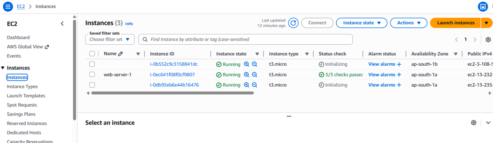

# Scalable-Web-App-with-ALB-and-Auto-Scaling
Scalable web application built using AWS EC2, Application Load Balancer (ALB), and Auto Scaling. Distributes traffic efficiently, ensures high availability, and automatically scales resources to handle varying workloads without downtime.

## 🎯 Purpose
Handle high traffic automatically without crashing.

## 🧰 AWS Services Used
- Amazon EC2
- Application Load Balancer (ALB)
- Auto Scaling Group
- Security Groups

## 📌 Project Overview
This project demonstrates how to build a scalable and highly available web application on AWS. 
Traffic is distributed using an Application Load Balancer, and Auto Scaling automatically adjusts 
the number of EC2 instances based on demand.

## 🚀 Features
- Load balancing using ALB
- Automatic scaling
- High availability
- Fault tolerance

## 📸 Project Screenshots

### EC2 Instances
This screenshot shows running EC2 instances used in the application.

### Auto Scaling Group
This shows how instances are automatically scaled based on demand.

### Load Balancer
ALB distributes incoming traffic across multiple EC2 instances.

### Target Group
Shows registered instances and their health status.

### Web Output 1
Application output running in browser.

### Web Output 2
Another view of application output.

